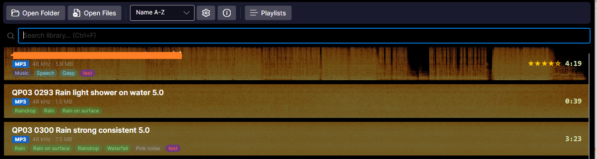
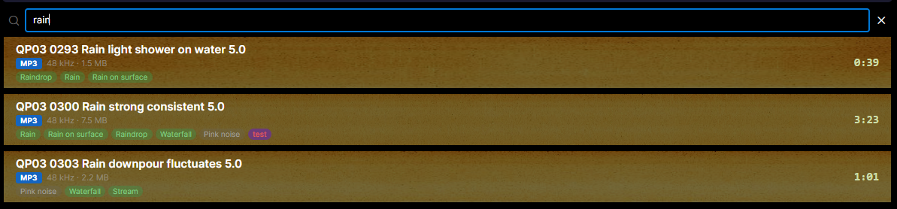
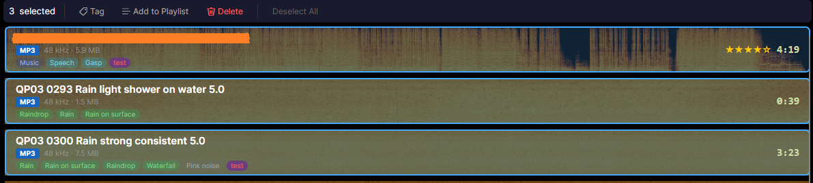
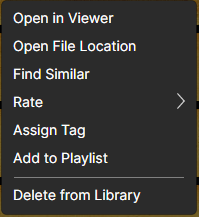
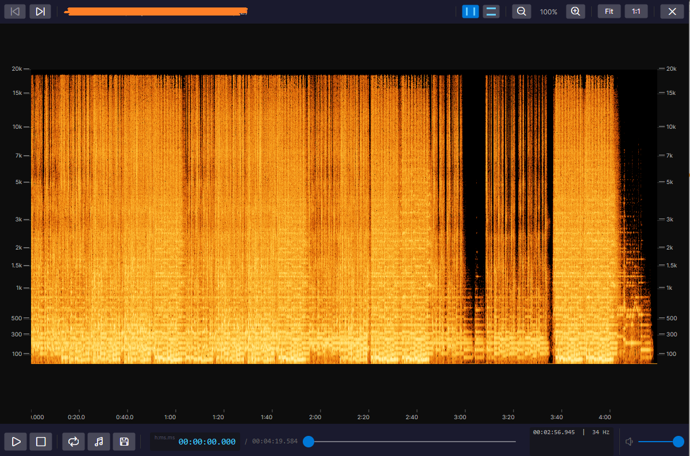
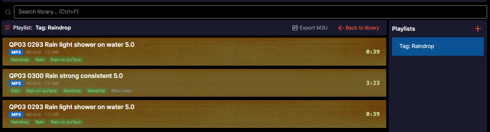
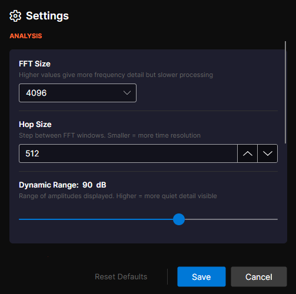
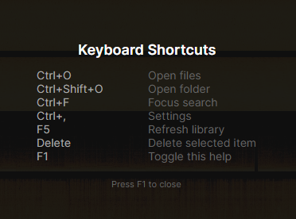
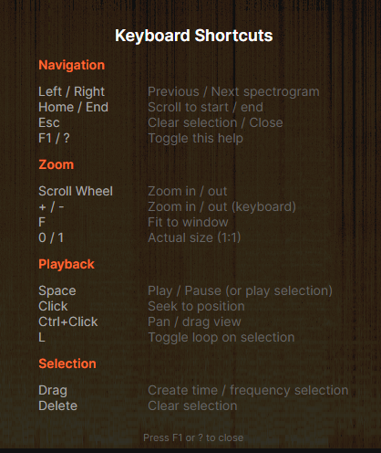

# Audio2Image — User Guide

Complete guide to using Audio2Image for spectrogram generation, analysis, and library management.

---

## Table of Contents

- [Getting Started](#getting-started)
- [Gallery](#gallery)
- [Spectrogram Viewer](#spectrogram-viewer)
- [Playback & Selection](#playback--selection)
- [AI Features](#ai-features)
- [Ratings & Tags](#ratings--tags)
- [Playlists](#playlists)
- [Settings](#settings)
- [Keyboard Shortcuts](#keyboard-shortcuts)

---

## Getting Started

### System Requirements

- **OS:** Windows 10/11 (x64)
- **Runtime:** .NET 10 (bundled in self-contained builds)
- **RAM:** 4 GB minimum, 8 GB recommended for large libraries
- **Disk:** ~400 MB for the application + space for spectrogram PNGs

### Installation

**Option A: Self-contained executable (recommended)**

Download `Audio2Image-v1.0.0-win-x64.zip`, extract, and run `Audio2Image.exe`. No additional runtime needed.

**Option B: Build from source**

```bash
dotnet build -c Release
dotnet run --project src/Audio2Image.App/Audio2Image.App.csproj -c Release
```

### First Launch

On first launch, Audio2Image creates a library directory at `Documents\Audio2Image` containing:
- `audio2image.db` — SQLite database for metadata, thumbnails, and embeddings
- `settings.json` — user preferences
- Spectrogram PNG files (generated during processing)

### Adding Audio Files

There are three ways to add audio files:

1. **Open Folder** (Ctrl+Shift+O) — select a directory to scan recursively for MP3/WAV/OGG files
2. **Open Files** (Ctrl+O) — pick individual audio files
3. **Drag and Drop** — drag audio files or folders directly onto the application window

Processing happens in parallel across all CPU cores. A progress bar shows the current status with percentage and the file being processed. You can cancel at any time with the Cancel button.

---

## Gallery

The gallery is the main screen of Audio2Image, displaying all processed spectrograms as a scrollable list.



### Gallery Items

Each item in the gallery shows:

- **Spectrogram thumbnail** — full-width background preview of the spectrogram
- **File name** — bold text in the top-left
- **Format badge** — color-coded pill (blue for MP3, green for WAV, purple for OGG)
- **Metadata** — sample rate and file size
- **AI tags** — auto-generated AudioSet labels as colored pills
- **User tags** — custom tags as colored pills (alongside AI tags)
- **Star rating** — gold stars (1-5) in the top-right
- **Duration** — formatted time display in the bottom-right
- **Similarity score** — percentage badge (visible in similarity mode)

### Sorting

Use the sort dropdown in the toolbar to order by:

| Sort Option | Description |
|-------------|-------------|
| Name A-Z | Alphabetical ascending |
| Name Z-A | Alphabetical descending |
| Date Added | Most recent first |
| Duration | Longest first |
| Rating | Highest rated first |

### Search

Press **Ctrl+F** to focus the search bar. Type to filter the library by filename. The status bar shows the result count. Clear the search with the X button or Escape.



### Multi-Select

Select multiple items for batch operations:

| Action | Input |
|--------|-------|
| Toggle single item | Ctrl+Click |
| Select range | Shift+Click |
| Select all | Ctrl+A |
| Deselect all | Escape |

When items are selected, a **batch action bar** appears with options to Tag, Add to Playlist, or Delete selected items.



### Context Menu

Right-click any gallery item to access:



| Action | Description |
|--------|-------------|
| **Open in Viewer** | Open the full spectrogram viewer |
| **Open File Location** | Open the audio file's folder in Explorer |
| **Find Similar** | AI-powered similarity search using audio embeddings |
| **Rate** | Assign 1-5 stars or clear rating |
| **Assign Tag** | Add/create user-defined tags |
| **Add to Playlist** | Add to an existing or new playlist |
| **Delete from Library** | Remove from library (with confirmation) |

---

## Spectrogram Viewer

Click any gallery item to open the full-screen spectrogram viewer.



### Layout

The viewer consists of:

- **Top toolbar** — navigation (Previous/Next), selection mode toggle, zoom controls, close button
- **Left frequency scale** — mel-scale axis from 20 Hz to 20 kHz
- **Right frequency scale** — mirrored mel-scale axis
- **Bottom time axis** — auto-scaling time labels synchronized with scroll position
- **Spectrogram image** — the main spectrogram with zoom and scroll
- **Transport bar** — playback controls, time display, seek bar, volume

### Navigation

| Action | Input |
|--------|-------|
| Previous track | Left Arrow or Previous button |
| Next track | Right Arrow or Next button |
| Scroll to start | Home |
| Scroll to end | End |
| Close viewer | Escape |

### Zoom

Audio2Image uses **horizontal-only zoom** — the frequency axis stays fixed while the time axis scales. This matches professional tools like iZotope RX.

| Action | Input |
|--------|-------|
| Zoom in | Mouse wheel up / + key |
| Zoom out | Mouse wheel down / - key |
| Fit to window | F key |
| Actual size (1:1) | 1 key |

The fit-to-window zoom level is the 100% baseline. You cannot zoom out past it.

### Panning

| Action | Input |
|--------|-------|
| Pan horizontally | Middle mouse button + drag |
| Pan (alternative) | Ctrl + left click + drag |
| Scroll | Horizontal scrollbar |

### Cursor Information

The transport bar shows real-time information about the mouse cursor position:
- **Time** — current time position under the cursor
- **Frequency** — current frequency under the cursor (mel-scale mapped)

---

## Playback & Selection

### Transport Controls

| Control | Action |
|---------|--------|
| **Play/Pause** | Space bar or Play button |
| **Stop** | Stop button |
| **Seek** | Click anywhere on the spectrogram or drag the seek bar |
| **Volume** | Volume slider in the transport bar |
| **Loop** | L key or Loop button (green when active) |

### Time Display

The transport bar shows playback position in `h:mm:ss.fff` format with a cyan-colored display.

### Selection Modes

Toggle between two selection modes using the toolbar buttons:

**Time Selection** (vertical strip):
- Click and drag horizontally to select a time range
- Playback will only play the selected range
- Enable loop (L) to continuously repeat the selection
- Export the selection as WAV with the Export button

**Frequency Selection** (horizontal strip):
- Click and drag vertically to select a frequency range
- Playback applies a real-time IIR Butterworth bandpass filter (24 dB/octave)
- Only the selected frequency band is audible

### Smart Playback Behavior

Press Space/Play and Audio2Image automatically detects what to play:

1. **Time selection active** — plays only the selected time range
2. **Frequency selection active** — plays full track through bandpass filter at selected frequencies
3. **No selection** — plays from current position to end
4. **Loop enabled** — repeats the time selection continuously

### Playback Cursor

During playback, a yellow teardrop marker with a dashed line tracks the current position across the spectrogram.

### Loop Finder

Click the **Find Loop Points** button (music note icon) to automatically detect optimal loop points in the audio using waveform analysis. Loop markers appear as green dashed vertical lines.

### Export Selection

With a time selection active, click the **Export** button (save icon) to save the selected range as a WAV file. Supports optional crossfade for seamless loops.

---

## AI Features

### Audio Embeddings

Audio2Image uses the **PANNs CNN14** model to generate 2048-dimensional audio embeddings for each track. These enable:

- **Similarity search** — find tracks that sound alike
- **Auto-tagging** — classify audio using 527 AudioSet labels

The ONNX model (~320 MB) is automatically downloaded from HuggingFace on first use. Processing happens in the background during idle time.

### Similarity Search

1. Right-click a track → **Find Similar**
2. The gallery switches to similarity mode, showing all tracks ranked by cosine similarity
3. Each item shows a percentage similarity score badge
4. Results can be exported as M3U or saved as a playlist

### Auto-Tagging

AI tags appear as colored pills on each gallery item. The top 5 AudioSet labels are shown, color-coded by category (e.g., music, speech, environmental sounds).

Click any AI tag to filter the library to all tracks with that tag.

---

## Ratings & Tags

### Star Ratings

Rate tracks from 1 to 5 stars:

1. Right-click → **Rate** → select 1-5 stars
2. Click the same star count again to clear the rating
3. Sort by Rating to see highest-rated tracks first

### User Tags

Create custom tags to organize your library:

1. Right-click → **Assign Tag** → select existing or create new
2. Tags appear as colored pill badges alongside AI tags
3. Click any user tag to filter the library
4. Rename or delete tags from the tag filter header

**Batch tagging:** Select multiple items (Ctrl+Click / Ctrl+A) → click Tag in the batch action bar.

---

## Playlists

### Managing Playlists

1. Click the **Playlists** button in the toolbar to open the sidebar
2. Click **+** to create a new playlist
3. Right-click a playlist to Rename or Delete



### Adding Tracks

- Right-click a track → **Add to Playlist** → select playlist
- Or: select multiple items → batch action bar → **Add to Playlist**

### Exporting

Playlists, tag filters, and similarity results can be exported as **M3U files** for use in external audio players. Click the **Export M3U** button in the respective mode header.

---

## Settings

Open Settings with **Ctrl+,** or the gear icon in the toolbar.



*Settings window showing the Analysis section. Scroll down for Appearance and Storage settings.*

### Analysis Settings

| Setting | Default | Range | Description |
|---------|---------|-------|-------------|
| **FFT Size** | 4096 | 2048–8192 | Frequency resolution. Larger values = more frequency detail, slower processing |
| **Hop Size** | 512 | 128–FFT Size | Time resolution. Smaller values = smoother spectrograms, larger PNG files |
| **Dynamic Range** | 90 dB | 40–120 dB | Visible amplitude range from peak. Higher values show more quiet detail |

### Appearance

| Setting | Options | Description |
|---------|---------|-------------|
| **Theme** | Dark / Light | Application color theme, applied instantly |
| **Colormap** | Hot / Viridis | Spectrogram color palette. Hot = orange/amber (RX style), Viridis = blue-green-yellow |

### Storage

| Setting | Description |
|---------|-------------|
| **Library Path** | Directory for spectrogram PNGs and database. Click Browse to change |

Click **Reset Defaults** to restore all settings to factory values.

---

## Keyboard Shortcuts

### Gallery Shortcuts



| Shortcut | Action |
|----------|--------|
| Ctrl+O | Open files |
| Ctrl+Shift+O | Open folder |
| Ctrl+F | Focus search bar |
| Ctrl+A | Select all |
| Escape | Deselect all / Close |
| Ctrl+, | Open Settings |
| F5 | Refresh library |
| Delete | Delete selected items |
| F1 | Show/hide keyboard shortcuts |

### Viewer Shortcuts

| Shortcut | Action |
|----------|--------|
| Space | Play / Pause |
| Escape | Close viewer |
| Left/Right Arrow | Previous / Next track |
| Home / End | Scroll to start / end |
| Mouse Wheel / +/- | Zoom in / out |
| F | Fit to window |
| 1 | Actual size (1:1) |
| L | Toggle loop |
| Delete | Clear selection |
| Ctrl+Drag | Pan |
| Middle Drag | Pan |
| F1 | Show/hide keyboard shortcuts |



---

## Supported Audio Formats

| Format | Extension | Notes |
|--------|-----------|-------|
| MP3 | `.mp3` | All bitrates and sample rates |
| WAV | `.wav` | PCM and IEEE float, mono and stereo |
| OGG Vorbis | `.ogg` | Via NAudio.Vorbis |

All stereo files are automatically downmixed to mono for spectrogram analysis. Original files are never modified.

---

## Troubleshooting

### Spectrogram appears black/empty
- Check that the audio file plays correctly in another player
- Try increasing the Dynamic Range in Settings (e.g., from 90 to 120 dB)
- Verify the file isn't corrupted or zero-length

### AI features not working
- The PANNs CNN14 model needs to be downloaded on first use (~320 MB)
- Check internet connection during first embedding computation
- Embedding status is shown in the gallery status bar

### Large library loads slowly
- First load may take time if thumbnail backfill is needed (one-time migration)
- Subsequent loads use cached JPEG thumbnails from the database
- Consider moving the library to an SSD for better I/O performance

### Audio playback issues
- Audio2Image uses NAudio's WaveOutEvent for playback
- Ensure Windows audio devices are properly configured
- Try restarting the application if playback stops working
